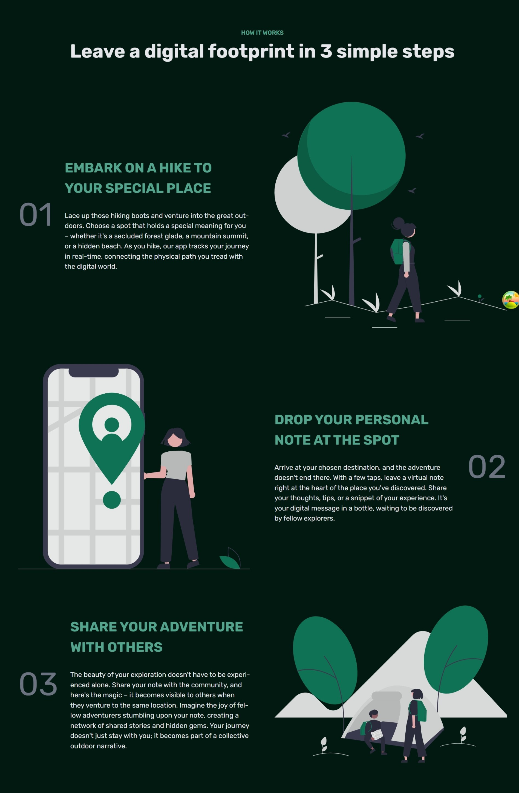
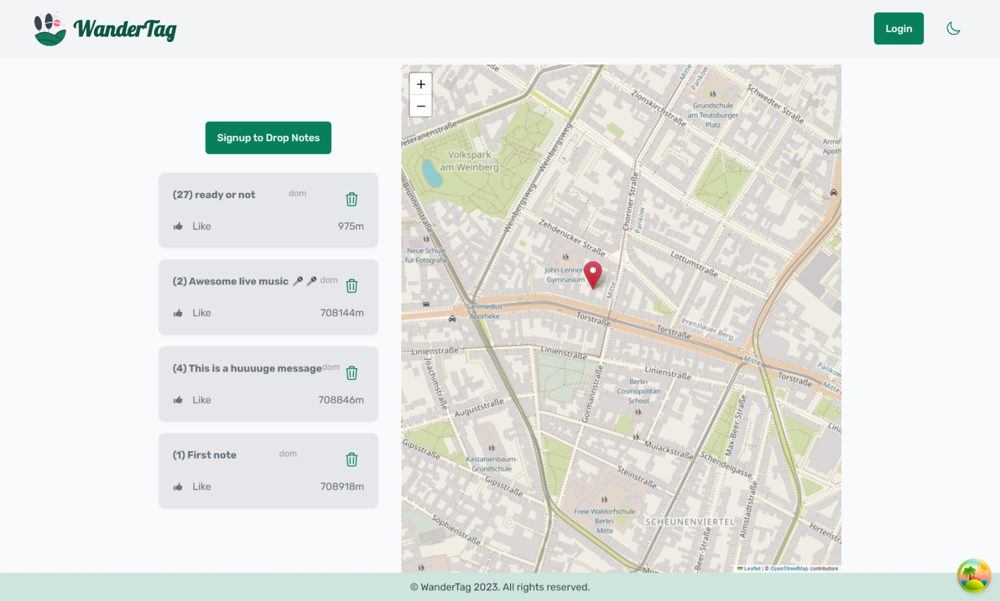

# WanderTag

> **Warning:** This project is still in development. Please refer to the list of open tasks at the bottom of the page. Come here often, since the application (and this readme) will change often as well ;-)

Welcome to WanderTag, where the great outdoors meets digital discovery!
Embark on a journey of exploration, as your passions and geolocation converge.
Leave virtual notes that come to life only when others venture into the same physical space.
Uncover hidden gems, share your outdoor wisdom, and forge connections with like-minded adventurers.
Your next adventure starts here.

  

  

# Tech Stack

- WanderTag is a web application build with React on Vite.
- Styled-Components is used for CSS purposes.
- Leaflet is used to provide a beautiful map for the notes.
- React-query is used for remote state management.
- Zustand is used for UI state management.

# Currently Open Tasks

- [x] Implement basic functionality
  - [x] Dropping notes
  - [x] Deleting notes
  - [x] Reading notes
  - [x] Users can sign up
  - [x] Users can sign up
  - [x] Notes visible in a List
  - [x] Notes visible on a map
  - [x] Home page explaining the details
- [x] Dark mode
- [ ] Deployment
- [ ] CI/CD
- [ ] Find away around user-set location
- [ ] Add Breakpoints for mobile users
