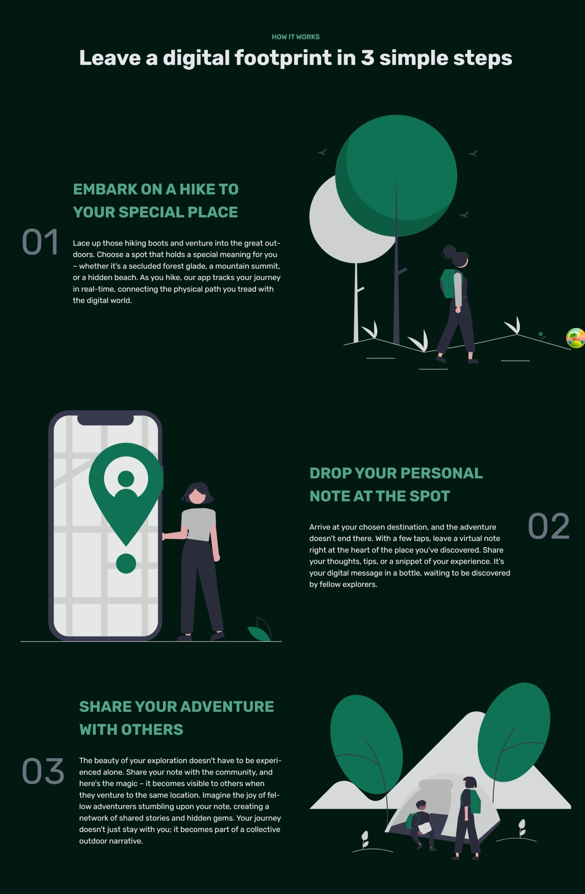
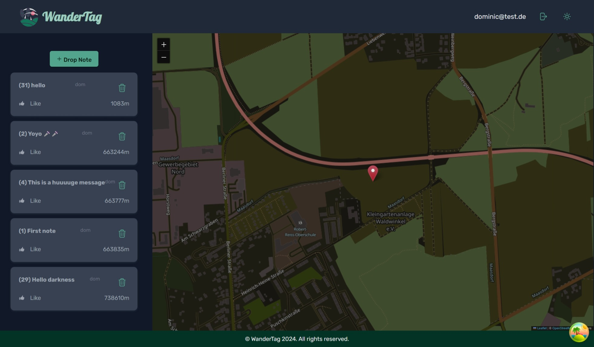

# **WanderTag**

Welcome to **WanderTag**—where the great outdoors meets digital discovery!

Embark on a journey of exploration where your passions intersect with your location. Leave virtual notes that come to life only when others venture into the same physical space. Uncover hidden gems, share your outdoor wisdom, and connect with like-minded adventurers.  
**Your next adventure starts here.** 🌍

  

  

## **Tech Stack**

WanderTag is built using a modern web development stack:

- **React** (with Vite) — For a fast, interactive user experience.
- **Styled-Components** — For modular and scoped CSS styling.
- **Leaflet** — Provides a beautiful, interactive map for notes and locations.
- **React-Query** — Manages remote state and data-fetching needs efficiently.
- **Zustand** — Simplifies UI state management.

## **Current Open Tasks**

Here's what's in progress and planned for future updates:

- **Core Features**:

  - [x] Implement basic functionality:
    - [x] Dropping notes
    - [x] Deleting notes
    - [x] Reading notes
    - [x] User registration (sign up)
    - [x] User authentication (sign in)
    - [x] Display notes in a list
    - [x] Show notes on a map
    - [x] Home page with detailed information
  - [x] Implement dark mode

- **To Be Completed**:
  - [ ] Deployment
  - [ ] Set up Continuous Integration / Continuous Deployment (CI/CD)
  - [ ] Implement dynamic location detection
  - [ ] Add responsive design breakpoints for mobile users

---

Feel free to contribute, suggest features, or report bugs—your feedback helps us make WanderTag even better!

Happy exploring! 🏕️

---

### **License**

This project is licensed under the [MIT License](LICENSE).

### **Contact**

For any questions or suggestions, please reach out to us at [dominic+wandertag at dobuch dot de](mailto:dominic+wandertag@dobuch.de).
